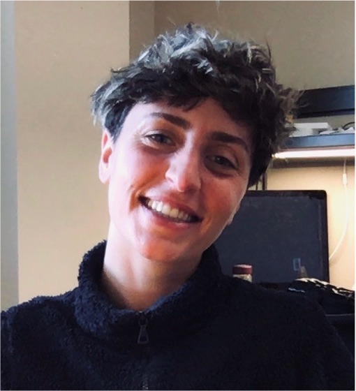

My name is 	**Elsa Abs** and I am a postdoctoral scholar at the University of California, Irvine. I am currently a member of the [Allison Lab](https://allisonlab.bio.uci.edu/) and working on integrating microbial eco-evolution in ecosystem carbon models.

I did my Ph.D. at the [Ecole Normale Superieure of Ulm](https://www.ibens.ens.fr/?lang=en) in Paris, France, in the [Eco-Evolutionary Mathematics](https://www.ibens.ens.fr/spip.php?rubrique30&lang=en) lab, where I worked I used game-theory based models to predict microbial eco-evolutionary responses to environmental change (soil diffusion, temperature) and consequences for soil carbon.

I am currently a [Marie Curie Postodoctoral Global Fellow](https://marie-sklodowska-curie-actions.ec.europa.eu/) at UC Irvine studying how eco-evolutionary processes can affect microbiomes’ functional response to selection using individual-based models of microbial litter decomposition. Starting in 2023, I will pursue research on integrating microbial emergent eco-evolutionary responses to drought into ecosystem models at the Laboratory for Sciences of Climate and Environment ([LSCE](https://www.lsce.ipsl.fr/en/index.php)) in Paris.

{width=50%}

See [here](Curriculum_vitae.pdf) for my complete CV.

## Research interests

Microbes have big impacts on Earth’s biogeochemical cycles. While we know that microbial community composition can shape function, we still don’t know how microbial function will vary with climate change. I’m interested in understanding and quantifying microbial eco-evolutionary responses to climate change, and when and where they will affect biogeochemistry at ecosystem scales. 

Using game-theory based models, I have predicted microbial resource allocation strategy as a function of abiotic factors (soil diffusivity, temperature), and the consequences for global soil carbon, especially in cold regions. I study also how eco-evolutionary processes affect microbiomes’ functional response to selection. Using an individual-based model, I have shown that taxa sorting is not enough to adapt to higher substrate quality, but adaptation is facilitated by dispersal. 

Currently, I’m working on identifying conditions under which mutation-selection and species sorting lead to different community functional responses to drought. I also work on how to integrate microbial eco-evo responses into ecosystem biogeochemical models. 

